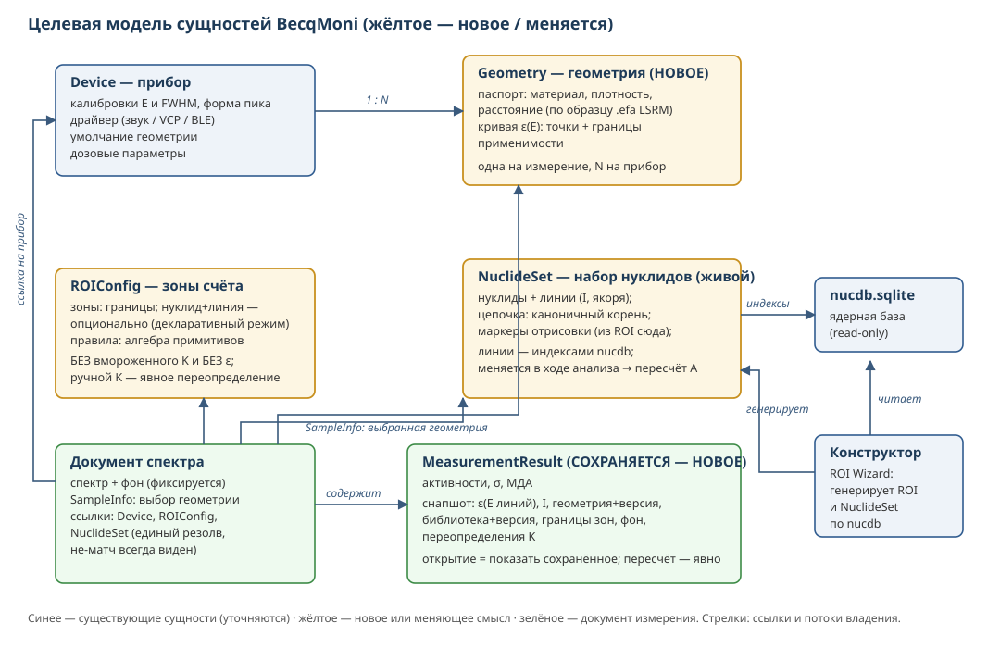
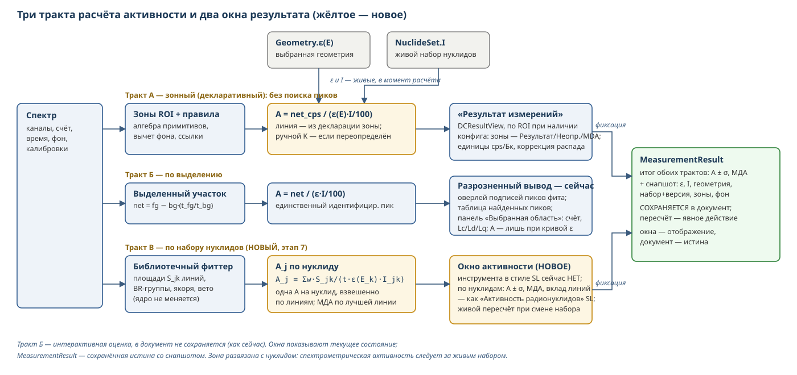

# ТЗ: правка архитектуры BecqMoni

Дата: 30.07.2026, ревизия 2 (после внутреннего адверсариального аудита: сверка всех адресов по d80c7ee и arch-документа автора по GitHub). Статус: концепт, предложение к обсуждению с автором BecqMoni.

База: arch-документ автора `arch/architecture-refactor.md` (ветка roi-wizard-reworked; 4 пункта, 9 общих правил совместимости) — наше ТЗ строится ПОВЕРХ него и явно помечает, что совпадает с решениями автора, а что — наши дополнения. Наши материалы: `BEST-SOLUTIONS.md`, `BECQMONI-VS-SPECTRALINE.md` рев. 4, `BECQMONI-ARCH-MAP.md`, пакет дефектов `ARCH-MAP-PENDING-FIXES.md`.

---

## 1. Концепт

### 1.1. Одна фраза

Развести три независимые оси — **прибор** (Device + его геометрии), **зоны счёта** (ROI + правила), **библиотеку** (NuclideSet) — и заставить активность вычисляться **в момент расчёта** из живых сущностей, а результат измерения **сохраняться со снапшотом** всего использованного.

### 1.2. Два принципа

**П1. Коэффициент — вычисление, ручной ввод — явное переопределение.**

*Что за коэффициент.* Прибор считает импульсы; зона ROI выдаёт скорость счёта net cps. Чтобы превратить её в активность, нужен пересчётный множитель: **A [Бк] = cps · K**, где **K = 1/(ε(E) · I/100)**. Здесь ε(E) — эффективность регистрации на энергии линии (доля испущенных образцом квантов, попавших в пик), I — интенсивность линии (квантов этой энергии на 100 распадов нуклида). K отвечает на вопрос «сколько распадов в образце стоит за одним зарегистрированным импульсом»; он свой у каждой пары «линия × геометрия измерения».

*Откуда он берётся сейчас.* Двумя путями: (а) вычисляется один раз в момент создания области в редакторе ROI — из тогдашней кривой ε и тогдашней I (ROIConfigForm.cs:957) — и записывается числом в ROI-файл; (б) вводится пользователем вручную — обычно подбором по эталонному источнику известной активности (поле ROIConfigForm.cs:742/888).

*В чём проблема.* Записанный K мёртв: смена кривой эффективности, геометрии или библиотеки до него не доходит — области продолжают считать по устаревшему числу, ничем это не выдавая. Области конструктора экспортируются вовсе без K — нуль активности (SetExporter.cs:51-69, дефект п.2 пакета).

*Целевое состояние* (= пункт 2 автора): K как хранимое расчётное число исчезает — при каждом расчёте берутся текущие ε(E) выбранной геометрии и I линии живой библиотеки. Хранится только **ручной ввод как переопределение**: всё, что пользователь ввёл руками (в т.ч. K по эталону), побеждает расчётное и сохраняется явно, с видимой пометкой «переопределено вручную». Автоматически «конвертировать» старые K в ε·I нельзя в принципе: у шести из 12 поставочных ROI-файлов нет Intencity, у Atom Nano 3 — 16 областей с K без кривой и без интенсивностей; такие K из ε·I невосстановимы — переопределение — единственный честный путь миграции.

**П2. Результат — не пересчёт, а документ.**
Сегодня результат измерения не сериализуется вовсе (MeasurementResultCollection — XmlIgnore, ResultData.cs:36-37): при каждом открытии он пересчитывается по текущим конфигам — смена кривой молча меняет прошлые числа. Целевое состояние: сохранённый результат несёт снапшот использованных величин (ε на энергиях линий, I, идентификатор и версия геометрии/библиотеки, границы зон, факт переопределения K) — как `.spef` LSRM «спектр со всеми данными» (📗 по конспекту документации). Отдельно фиксировать **фон**: сейчас в документе хранится только имя файла фона (ResultData.cs:111-131), а от него зависят net и МДА — снапшот без фона воспроизводимость не гарантирует.

**Связка П1+П2.** П1 без П2 опасен: живой коэффициент при непересохраняемом результате = история, переписываемая задним числом. Поэтому до ввода снапшота (этап 5) расчёт по умолчанию остаётся в legacy-режиме, живой путь включается настройкой; парой они становятся поведением по умолчанию.

### 1.3. Что сознательно сохраняется

- **Двойственность трактов**: декларативный ROI (счёт без поиска пиков) и спектрометрический (NuclideSet + фиттер, активность не считает) — сильнейшая собственная черта BM; рефакторинг её оформляет, не устраняет.
- Пуассоновский фиттер, формы пика, RJMCMC, стабилизация шкалы — ядро не трогается.
- Встроенный конструктор (ROI Wizard) — становится потребителем новых сущностей.

---

## 2. Целевая схема

Пояснения к схеме:
- **Geometry** — новая сущность при Device (1:N), по образцу паспорта `.efa` LSRM; выбор в SampleInfo измерения (= решение автора: SampleInfoData + умолчание в конфиге устройства); несёт кривую ε(E) и дозовые параметры.
- **ROIConfig** — зоны и правила без вычисляемого K и без ε (ручные переопределения — явными полями); нуклид у зоны опционален (декларативный режим); границы: кэВ в пределах класса детекторов либо доли ПШПВ (перенос между классами).
- **NuclideSet** — живой набор: цепочка каноничным корнем («U-238», решение автора), маркеры отрисовки переезжают сюда из ROI (пункт 4 автора), линии — стабильными индексами nucdb (наше дополнение, идея индексации NuclideMaster).
- **MeasurementResult** — сохраняется со снапшотом {ε(E_линий), I, геометрия+версия, библиотека+версия, границы зон, фон, переопределения}.
- Расчёт активности: A = net_cps / (ε(E) · I/100), ε и I — живые, в момент расчёта; ручное переопределение K, если задано, побеждает и помечается.

### 2.1. Расчёт активности: где он живёт

Ключевое отличие от SpectraLine, которое надо понимать при чтении ТЗ. У SL активность — отдельный блок ПОВЕРХ фита, привязанный к библиотеке нуклидов: фит даёт площади пиков, затем по каждому идентифицированному нуклиду решается S_k = A_j·I_jk по всем его линиям — одна активность на нуклид. У BM активность привязана к **зоне**: каждая ROI-зона несёт нуклид и энергию линии, активность = счёт зоны × 1/(ε·I); NuclideSet и фиттер только идентифицируют, их площади в активность не транслируются (LibraryPeakFitter — идентификация и площади, расчёта активности в нём нет).

**Решение этого ТЗ (предложение нашей стороны): развязать зону и нуклид.** Зона — чистое окно счёта; нуклидную семантику даёт живой NuclideSet, который **может меняться в процессе анализа** — смена набора пересчитывает активности без правки зон (как в SL: поменял библиотеку → пересчитал). Нуклид в зоне остаётся опциональным полем для декларативного режима (тракт А), но жёсткая связь «зона = нуклид навсегда» уходит вместе с замороженным K.

Тракты активности по этому ТЗ:

| Тракт | Вход | Привязка | Статус |
|---|---|---|---|
| А. Зонный (ROI, декларативный) | net cps зоны (алгебра примитивов) | зона → нуклид+линия (опциональная декларация) | сохраняется для слабой статистики и мониторинга; этапы 2–3 меняют источник ε/I на живой |
| Б. По выделению | net выделенного участка × 1/(ε·I) единственного идентифицированного пика | пик → линия | сохраняется как есть |
| В. По набору нуклидов (SL-подобный) | площади библиотечного фиттера по ВСЕМ линиям нуклида | живой NuclideSet → нуклид (одна A на нуклид, взвешенно по линиям) | НОВЫЙ основной спектрометрический тракт, этап 7 |

Тракт В — то, чего BM не хватает относительно SL: фиттер уже считает площади, держит BR-группы (амплитуды линий цепочки в фиксированных отношениях интенсивностей) и знает принадлежность линий нуклидам набора — блок A_j из S_jk/(t·ε(E_k)·I_jk) со взвешиванием по линиям достраивается поверх без вмешательства в сам фит. Требует живых ε/I (этапы 2–3), поэтому идёт после них. Смена набора в ходе анализа — штатная операция: активности тракта В пересчитываются от текущего набора, в снапшот результата уходит именно тот набор (и его версия), с которым числа посчитаны.

Функциональная схема трактов:

### 2.1а. Три уровня понятия «активность»

Термин «активность» в тракте расщепляется на три разных результата — их нельзя смешивать ни в модели, ни в UI:

| Уровень | Величина | Что нужно для расчёта | Где в тракте |
|---|---|---|---|
| 1. Активность нуклида в счётной форме | A, Бк | net-счёт + ε(E) геометрии + I линии | этап 4 |
| 2. Удельная / объёмная активность образца | A/m (Бк/кг), A/V (Бк/л) | уровень 1 + масса или объём из SampleInfo, при геометрии, соответствующей образцу | этап 5 (НОВОЕ) |
| 3. Регуляторная оценка | заключение «соответствует / не соответствует» | уровень 2 + таблица нормативов | этап 5 (НОВОЕ) |

Уровень 2 без правильной геометрии — бессмыслица (ε для другой матрицы/сосуда), поэтому этап 5 стоит после выбора геометрии и живого расчёта. Уровень 3 — по образцу плагина спецотчётов SpectraLine: пороги (СанПиН, ТР ТС и др.) — в редактируемой таблице, не в коде; заключение попадает в результат и снапшот.

### 2.2. Откуда берётся кривая эффективности

Кривая ε(E) живёт в Geometry прибора; «правильная» кривая — та, чей паспорт (сосуд, материал/плотность образца, расстояние) совпадает с реальным измерением — по образцу LSRM, где кривая из `.efa` подбирается по шифрам детектора и геометрии спектра автоматически. Каналы наполнения:

| Канал | Источник | Формат входа | Статус в BM |
|---|---|---|---|
| Расчётный (ЛСРМ) | EffCalcMC (Nuclide Master Plus): Монте-Карло по модели детектора из GMaster | `EffCalcMC.txt`, `.efr/.efa` | импорт EffCalcMC.txt есть (MainForm.cs:2529), но льёт в ROI-файл — перенаправить в Geometry (этапы 3/6); поставочные Exported Curves — этот канал |
| Измерительный (ЛСРМ) | программа Efficiency по эталонному источнику `.src`, абсолютный/относительный метод | `.efr` (точки) / `.efa` (кривая с паспортом) | аналога нет; прямой ридер `.efa` — желательное расширение этапа 3: формат текстовый, секции `<детектор>;<геометрия>` уже несут паспорт |
| Внешний Монте-Карло-код | расчёт по модели детектора вне BM | те же `.efa/.efr` либо таблица ε(E) | подключается тем же импортом, что каналы выше — отдельного кода не требует |
| Legacy | точки ε существующих ROI-файлов | ROIEfficiency | миграция: кривая геометрии с именем от имени конфига (правило 2 §4) |

Требования ко всем каналам:
1. Кривая принимается **только с паспортом** (геометрия, материал, плотность, расстояние, энергетический диапазон применимости); при импорте без паспорта поля заполняет пользователь, и это фиксируется в геометрии.
2. Выход энергии линии за диапазон кривой при расчёте — видимое предупреждение, не молчаливое поведение (сейчас сплайн без экстраполяции — ROIAriphmetics.cs:175, и пользователь об обрезке не узнаёт).
3. Санитарный контроль точек при импорте: монотонность энергий, физичные пределы ε, погрешности. Прецедент необходимости: узел 20 кэВ с ε=1471,85 (ErrorPercent=554) в поставочной кривой Obsidian прошёл в продукт без единой проверки.

---

## 3. Состав работ (этапы)

Порядок — по arch-документу автора (цепочка → коэффициент → геометрии+доза → маркеры); этапы 0, 5, 6 — наши дополнения.

**Этап 0 (наш). Санитария ссылок** — подготовка, без изменения модели.
Единый механизм резолва ссылок с одним предсказуемым исходом не-матча. Сейчас исходов четыре: тихо (DocumentManager.cs:1355-1390 + фолбэк [0] при заданном, но не найденном Guid — DocEnergySpectrum.cs:449-458), откат (DCControlPanel.cs:589-599), диалог (MeasurementController.cs:218-221), исключение (MainForm.cs:2670/2680, EasyControl). Кроме Guid — строковые ссылки той же хрупкости: ROIReferenceData.Reference по имени области (переименование рвёт молча), поиск конфига по имени в SelectROIDialog (одноимённые — коллизия, п.25 пакета). Критерий: ни один путь не падает и не подменяет конфиг молча; не-матч виден пользователю.

**Этап 1. Формализация цепочки** (= пункт 1 автора + наше дополнение).
От автора: поле цепочки с каноничным корнем («U-238», не машинный слаг), единая реализация ChainOf (сейчас две: LibraryPeakFitter.cs:952 и SetChecker.cs:279), FormatVersion для NuclideDefinition с семантикой «отсутствует = legacy». Наше дополнение: линии набора — стабильными индексами nucdb (ссылка не рвётся при переоценке энергии; естественное место генерации — конструктор). Разблокирует перенос вкладки «Цепочки» в WinForms-конструктор.

**Этап 2. Живой коэффициент** (= пункт 2 автора, модель П1).
Расчётный путь уже существует (EnergySpectrumView.cs:736-762) — он становится основным; ручной ввод остаётся переопределением (правило автора «ручное побеждает расчётное»). До этапа 5 живой путь — за настройкой, по умолчанию legacy (связка П1+П2). SetExporter конструктора переводится на новую схему (закрывает «области мастера без K»). Отдельно определить поведение при невычислимом K: нет геометрии / Intencity=0 / зона без нуклида / зона-ссылка — каждый случай виден пользователю, а не нуль молча (у автора: «геометрия не выбрана» должно быть видно).

**Этап 3. Геометрия + доза** (= пункт 3 автора; решение принято: выбор в SampleInfo, умолчание в конфиге устройства).
Сущность Geometry по образцу паспорта `.efa` LSRM (📗): кривая ε с условиями применимости (материал, плотность, расстояние). Дозовый тракт — из данных прибора, не из 16 узлов, зашитых в форму (DeviceConfigForm.cs:2522-2577). Попутно: граничный дефект дозы п.22 пакета (двойной учёт канала на стыке); п.21 (InvalidCastException при нелинейной калибровке, DoseRateManager.cs:32) — отдельной правкой рантайма, переездом сам не закрывается. Импорт кривых из существующих ROI-файлов — в геометрию с именем, производным от имени конфига (по автору: «RadiaCode Marinelli 0.5» → «Маринелли 0.5»).

**Этап 4. Маркеры → NuclideSet** (= пункт 4 автора).
Перенос отрисовки вертикальных линий (маркеров) из ROI-конфига в NuclideSet, с минами миграции по списку автора (предикаты −10/−100, запрет удаления ROI-конфигов до конвертации, IsAnchor и пр.). Наше дополнение (отдельным пунктом, не смешивать): формализация конвейера правил ROI (вычитание фона, ссылки между зонами, сложение) как явного упорядоченного списка; опционально — границы зон в долях ПШПВ для переносимости между классами детекторов (наш В2).

**Этап 5 (наш). Снапшот результата** (П2; наш В1 к arch-документу).
Сериализация MeasurementResult со снапшотом (состав — §1.2 П2, включая фон); при открытии — «показать сохранённое» по умолчанию, «пересчитать по текущим конфигам» — явное действие с пометкой в результате. После этого этапа живой расчёт (этап 2) становится умолчанием.

**Этап 6 (наш). Конструктор на новых сущностях.**
Генерация NuclideSet по индексам nucdb; генерация областей по схеме этапа 2; импорт EffCalcMC — в кривую геометрии, а не в ROI-файл; перенос справочника цепочек (равновесная нормировка) из веб-версии — после этапа 1.

**Этап 7 (наш). Активность по набору нуклидов** (тракт В, §2.1) — новый основной спектрометрический тракт.
Блок расчёта поверх библиотечного фиттера: для каждого принятого нуклида набора A_j из площадей его линий S_jk/(t·ε(E_k)·I_jk), одна активность на нуклид, взвешенное среднее по линиям с σ; МДА по лучшей линии. Аналог базового метода SL (там активность — параметр самого фита; здесь — постобработка площадей, чтобы не трогать ядро фиттера). Развязка зоны и нуклида: набор можно менять в процессе анализа, активности пересчитываются без правки зон; использованный набор и его версия фиксируются в снапшоте.
UI: сейчас результаты размазаны по местам — оверлей подписей фита на спектре, таблица найденных пиков, значение на выделении (тракт Б), плюс DCResultView по зонам. Разделение целевое: DCResultView остаётся окном зонного тракта А как есть; спектрометрический вывод консолидируется в **новом окне активности по нуклидам** — аналоге окна «Активность радионуклидов» SpectraLine: по каждому нуклиду A ± σ, МДА, вклад линий, живой пересчёт при смене набора. Оверлей на спектре остаётся визуальной подсказкой, но перестаёт быть единственным местом, где виден результат фита. Все окна — отображение; сохранённая истина — MeasurementResult со снапшотом (этап 5). Зависит от этапов 2–3 (живые ε/I) и 1 (цепочка: линии дочерних приписываются корню с равновесной нормировкой). Двойственность §1.3 становится тройственностью осознанно: зонный тракт остаётся для слабой статистики и низкого разрешения, набор-тракт — для спектрометрической работы.

**Этап 8 (наш). Оценка образца** (§2.1а, уровни 2–3).
Удельная/объёмная активность A/m, A/V из массы и объёма SampleInfo; сравнение с нормативами по редактируемой таблице порогов (по образцу спецотчётов SpectraLine: пороги в данных, не в коде); заключение — в результат и снапшот. Зависит от этапов 3 (геометрия) и 5 (снапшот). Валидация: нет массы/объёма — уровень 2 недоступен видимо, а не нулём.

---

## 4. Правила совместимости и миграции

Опираются на «правила, общие для всех пунктов» автора; здесь — критичное для этого ТЗ.

1. FormatVersion: у DeviceConfig, ROIConfig и документа спектра он уже есть; вводится для NuclideDefinition — с семантикой «отсутствует = legacy», а НЕ жёстким гейтом (автор прямо предостерегает от повторения механизма DeviceConfigManager.cs:82-87, где любое незнакомое значение уводит файл в 097b-конвертер); DeviceConfigInfo.FormatVersion не бампать.
2. Старые файлы читаются всегда: замороженный K импортируется как ручное переопределение (невосстановим из ε·I — см. П1), точки ε ROI-файла — как кривая геометрии с именем от имени конфига.
3. Ни один существующий результат не меняется числом от самого факта апгрейда: до этапа 5 умолчание — legacy-расчёт; первый пересчёт по новой схеме помечается явно.
4. Пересохранение документа СТАРОЙ сборкой молча стирает незнакомые XML-элементы (нет обработчиков UnknownElement — правило 3 автора): формат снапшота выбирать с учётом этого (отдельная секция/файл либо версионный гейт), сценарий входит в приёмку.
5. Поставка чинится вместе с моделью: дефект данных Obsidian 20 кэВ (ε=1471,85), пустые наборы/якоря NuclideDefinition.xml (библиотечный фит из коробки не стартует — гейты LibraryPeakFitter.cs:471, 483-485), файлы без Intencity. Учесть: поставочный config копируется только при отсутствии каталога (MainForm.cs:102-103) — существующим пользователям нужна рантайм-миграция, свежая установка не покрывает.
6. Каждый этап — отдельный PR со своими тестами; этапы 1–2 не начинать до этапа 0; этапы 2 и 5 связаны через умолчание (см. П1+П2).

---

## 5. Открытые вопросы (решает автор / совместно)

1. **Матрица образца** (наш В5): самопоглощение не живёт нигде — поле паспорта геометрии (материал+плотность, как у LSRM) или отдельная сущность? Минимум для этапа 3 — паспортные поля без пересчёта; пересчёт на плотность — потом.
2. **Переносимость ROI между классами детекторов** (наш В2): доли ПШПВ или честная оговорка «в пределах класса»?
3. Формат снапшота: внутри документа спектра или отдельной секцией/файлом — с учётом правила 4 §4 (стирание старой сборкой).
4. Фиксация фона в снапшоте: копия спектра фона или хеш+ссылка?
5. Судьба Dose-вкладки ROI-конфига после переезда дозы к прибору.
6. Вопрос 3 автора к нам (ручной ввод K) — наш ответ: сохранять как переопределение (П1), см. согласование.

---

## 6. Критерии приёмки (сценарии)

| № | Сценарий | Ожидание |
|---|---|---|
| 1 | Изменить кривую ε геометрии → открыть СТАРЫЙ сохранённый результат | числа НЕ изменились; виден снапшот; «пересчитать» — явное действие |
| 2 | Тот же спектр, та же зона, новая геометрия | активность пересчиталась по ε новой геометрии без правки ROI-файла |
| 3 | Область, созданная конструктором | расчётная активность совпадает с областью, созданной вручную по той же линии и геометрии |
| 4 | Переименовать нуклид / пересчитать библиотеку | набор не развалился (ссылки по индексам, не по именам/энергиям) |
| 5 | Удалить конфиг, на который ссылается документ; переименовать область-цель ссылки | внятное сообщение, без исключения и без молчаливой подмены |
| 6 | Свежая установка из коробки И апгрейд существующей | библиотечный фит запускается в обоих случаях (наборы и якоря доехали) |
| 7 | Старый документ/ROI-файл прошлой версии | открывается; числа legacy-режима совпадают со старой версией, КРОМЕ показаний, затронутых исправленными дефектами (фиксированный список: доза пп.21-22, Obsidian ε=1471,85, MDA п.17 пакета) |
| 8 | Смена прибора при том же ROI (в пределах класса) | границы валидны либо явное предупреждение о непереносимости |
| 9 | Зона с невычислимым K (нет геометрии / I=0 / ссылка) | видимый статус, не молчаливый нуль |
| 10 | Пересохранение документа со снапшотом старой сборкой | снапшот не теряется молча (формат выдерживает или потеря явно детектируется новой сборкой) |
| 11 | Смена NuclideSet в процессе анализа | активности тракта В пересчитаны по новому набору, зоны не тронуты, снапшот несёт использованный набор и его версию |
| 12 | Образец с массой/объёмом + включённый норматив | удельная активность и заключение в результате; без массы — уровень «Бк/кг» видимо недоступен, не нуль |
